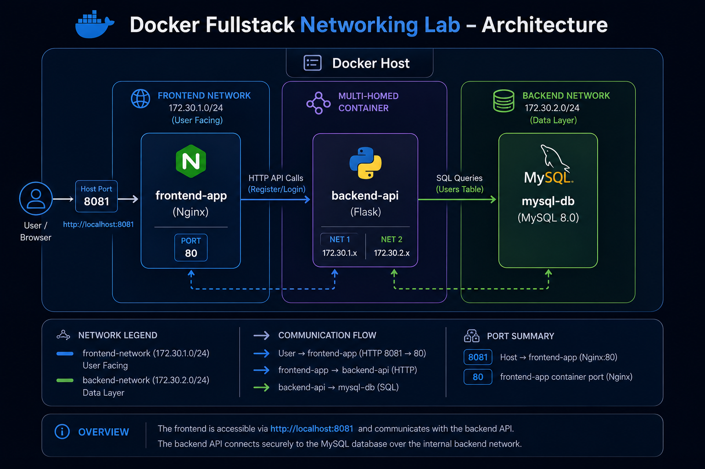

# Docker Fullstack Networking 


A **Full-Stack application** demonstrating advanced **Docker Networking**, secure authentication, and multi-container architecture.
---

##  Project Overview

This lab showcases a real-world scenario where users can **register** and **login** through a modern web interface. All data is securely stored in a MySQL database running inside Docker containers with proper network segmentation.

### Key Highlights

- Proper **network segmentation** using custom bridge networks
- **Multi-homed container** (backend connected to both frontend and backend networks)
- **Secure password storage** using cryptographic hashing (never plain text)
- Full infrastructure defined as code with Docker Compose
- Clean separation between Frontend, Backend, and Database layers

---

##  Architecture



### Architecture Explanation

| Layer          | Container          | Network                  | IP Address          | Exposed Port | Responsibility                     |
|----------------|--------------------|--------------------------|---------------------|--------------|------------------------------------|
| **Frontend**   | `frontend-app`     | `frontend-network`       | `172.30.1.10`       | `8081`       | Web interface (Nginx)              |
| **Backend**    | `backend-api`      | `frontend-network` + `backend-network` | `172.30.1.11` / `172.30.2.10` | `5000` | REST API + Authentication logic    |
| **Database**   | `mysql-db`         | `backend-network`        | `172.30.2.20`       | -            | MySQL 8.0 (users with hashed passwords) |

**Key Networking Concept**: The `backend-api` is a **multi-homed container** — it belongs to both networks at the same time. This allows it to receive requests from the frontend while securely accessing the database without exposing the database to the frontend network.

---

## 🛠️ Tech Stack

| Layer         | Technology                    | Purpose                                      |
|---------------|-------------------------------|----------------------------------------------|
| **Frontend**  | Nginx + HTML5 + CSS3 + JS     | Modern responsive login/register interface   |
| **Backend**   | Flask (Python 3.11)           | REST API with `/register` and `/login`       |
| **Database**  | MySQL 8.0                     | Persistent storage with hashed passwords     |
| **Orchestration** | Docker + Docker Compose   | Infrastructure as Code                       |
| **Networking**| Custom Bridge Networks        | Network segmentation and isolation           |
| **Security**  | Werkzeug (bcrypt-based)       | Password hashing and verification            |

---

##  Security Highlights

- Passwords are **never stored in plain text**
- Uses `werkzeug.security.generate_password_hash()` (PBKDF2 + SHA256)
- Strong password validation (minimum 6 characters)
- Database is **not directly accessible** from the frontend network
- Only the backend can communicate with MySQL

---

##  Getting Started

### Prerequisites

- Docker Desktop / Docker Engine
- Docker Compose v2+
- Git (optional)

---

##  Getting Started

### Prerequisites

- Docker Desktop / Docker Engine
- Docker Compose v2+
- Git (optional)

 How to Test

Open the frontend at http://localhost:8081
Go to the Register tab and create an account
Go to the Login tab and authenticate
Try registering the same username again → should return error
Try logging in with wrong password → should return error

You can verify the data in MySQL:
Bashdocker compose exec mysql-db mysql -u root -pDevOpsLab2025 -e "
USE fullstack_lab;
SELECT id, username, created_at FROM users;
"

 Key Learnings

How to design secure multi-tier applications using Docker networks
Why storing plain-text passwords is dangerous
The importance of network segmentation in containerized environments
How to implement Infrastructure as Code with Docker Compose
Practical use of multi-homed containers


---

##  Getting Started

### Prerequisites

- Docker Desktop / Docker Engine
- Docker Compose v2+
- Git (optional)

### Run the Lab

```bash
# 1. Navigate to the project
cd docker-fullstack-networking-lab

# 2. Make the test script executable
chmod +x scripts/test-lab.sh

# 3. Build and start all services
docker compose up -d --build

# 4. Verify everything is running
./scripts/test-lab.sh
